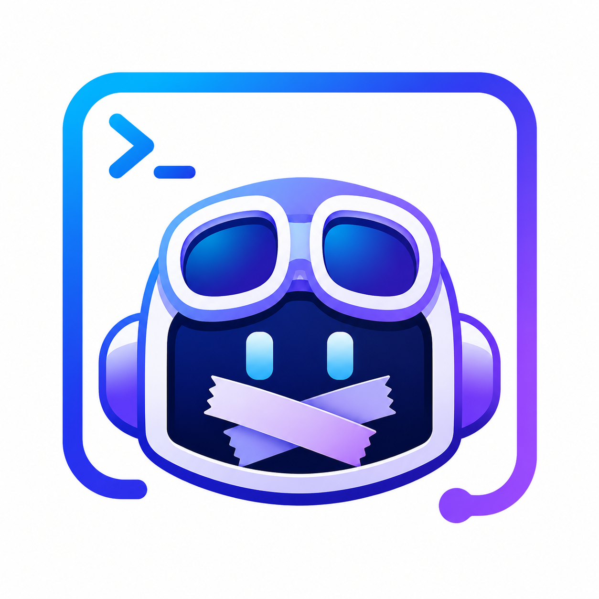

# Copilot Custom System Prompt

<p align="center">
  
</p>

Load replacement and appended system prompts into the ordinary GitHub Copilot
CLI interface. The extension uses Copilot SDK's supported `systemMessage` API,
so Copilot keeps its native authentication, subscription billing, tools, and
model routing.

## Requirements

- GitHub Copilot CLI 1.0.82 or later with experimental features enabled
- Node.js 20.19 or later
- A GitHub Copilot subscription, unless the CLI uses BYOK

## Install from npm

Install the package globally, then install its extension into Copilot CLI:

```sh
npm install --global copilot-custom-system-prompt
copilot-custom-system-prompt install
```

Restart Copilot CLI with extension support enabled:

```sh
copilot --experimental
```

Without `--experimental`, Copilot 1.0.82 discovers the plugin but does not load
its extension. To replace an existing installation
during an upgrade, run:

```sh
copilot-custom-system-prompt install --force
```

## Configure prompts

Create either prompt file under `~/.copilot/`:

- `SYSTEM.md` replaces Copilot's SDK-managed system prompt.
- `APPEND_SYSTEM.md` appends instructions to Copilot's SDK-managed prompt.

When both files exist, the extension replaces Copilot's prompt with `SYSTEM.md`
and appends `APPEND_SYSTEM.md` to that replacement.

Restart Copilot CLI after you change either file. Set `COPILOT_HOME` if your
Copilot configuration lives somewhere other than `~/.copilot`.

## Contributing

See [CONTRIBUTING.md](CONTRIBUTING.md) for local development, testing, and release
instructions.
